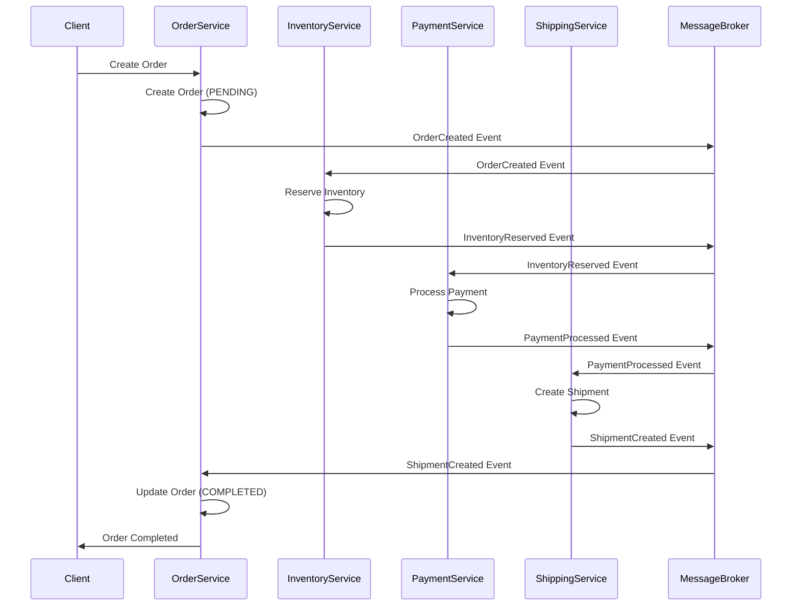
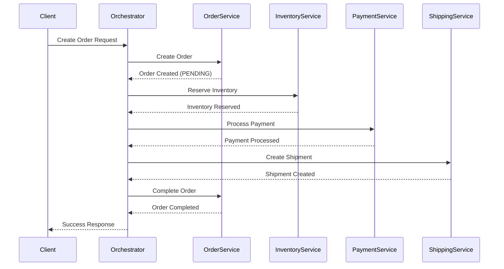
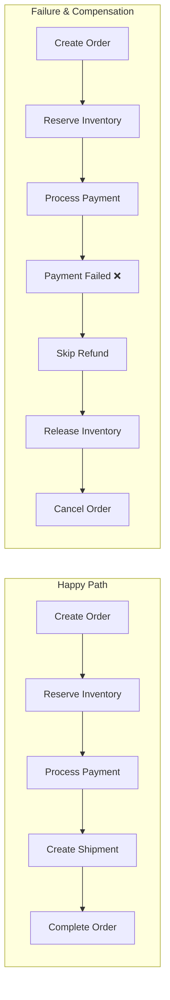
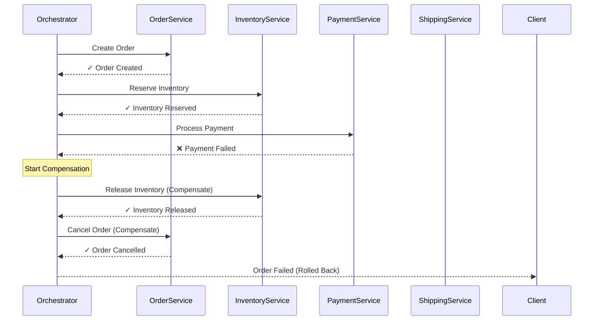
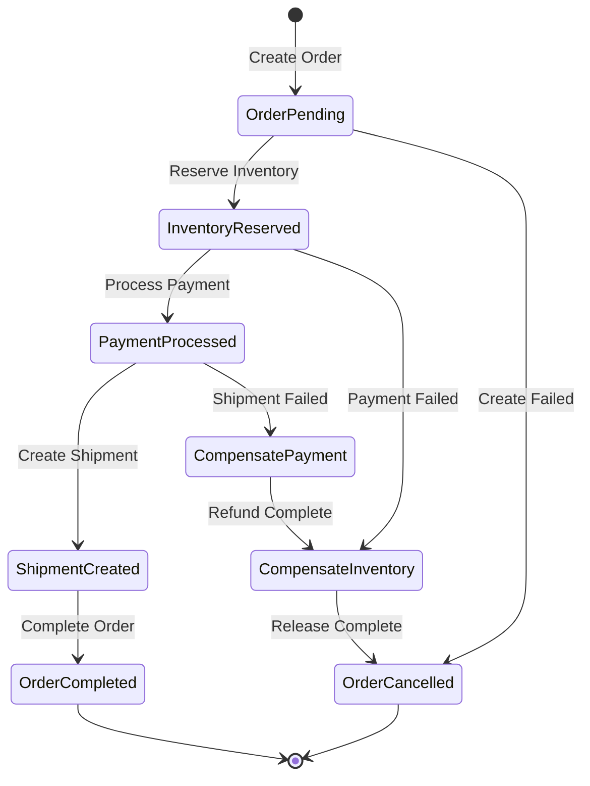
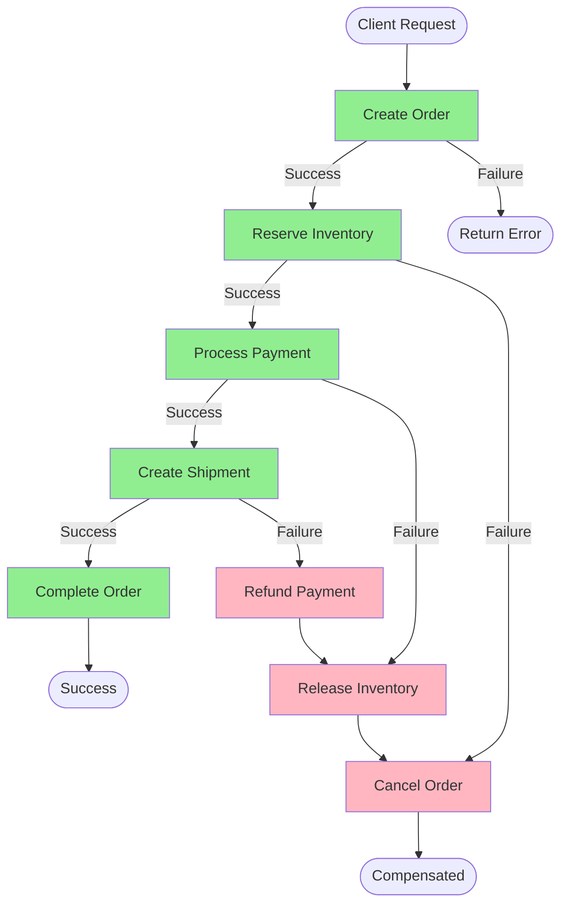
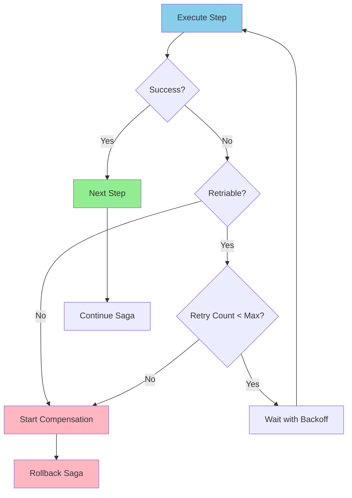

# Saga Pattern Architecture Diagrams

## 1. High-Level Saga Flow

### Choreography-Based Saga (Event-Driven)



### Orchestration-Based Saga (Command-Driven)



## 2. Compensation Flow (Rollback)

### Successful Path vs. Failed Path



### Detailed Compensation Sequence



## 3. State Machine View

### Order Saga State Transitions



## 4. Choreography Architecture

### Event-Driven Microservices

```
                    ┌─────────────────────┐
                    │   Message Broker    │
                    │   (Kafka/RabbitMQ)  │
                    └──────────┬──────────┘
                               │
        ┌──────────────────────┼──────────────────────┐
        │                      │                      │
        ▼                      ▼                      ▼
┌───────────────┐      ┌───────────────┐     ┌───────────────┐
│ Order Service │      │   Inventory   │     │    Payment    │
│               │      │    Service    │     │    Service    │
├───────────────┤      ├───────────────┤     ├───────────────┤
│ - Create      │      │ - Reserve     │     │ - Process     │
│ - Complete    │      │ - Release     │     │ - Refund      │
│ - Cancel      │      │               │     │               │
└───────┬───────┘      └───────┬───────┘     └───────┬───────┘
        │                      │                     │
        │ OrderCreated         │ InventoryReserved   │ PaymentProcessed
        └──────────────────────┴─────────────────────┘
                               │
                               ▼
                       ┌───────────────┐
                       │   Shipping    │
                       │    Service    │
                       ├───────────────┤
                       │ - Create      │
                       │ - Cancel      │
                       └───────────────┘

Events Flow:
1. OrderCreated → Inventory listens
2. InventoryReserved → Payment listens
3. PaymentProcessed → Shipping listens
4. ShipmentCreated → Order listens
```

### Choreography Event Flow (ASCII)

```
Time →

OrderService:     [Create]──→[Wait]──────────────→[Complete]
                     │                               ▲
                     │OrderCreated                   │ShipmentCreated
                     ▼                               │
InventoryService:  [Wait]──→[Reserve]──→[Wait]──────┤
                               │                     │
                               │InventoryReserved    │
                               ▼                     │
PaymentService:             [Wait]──→[Process]──→[Wait]
                                        │            │
                                        │PaymentProcessed
                                        ▼            │
ShippingService:                     [Wait]──→[Create]──┘
```

## 5. Orchestration Architecture

### Centralized Orchestrator

```
                    ┌─────────────────────────┐
                    │   Saga Orchestrator     │
                    │  (Workflow Engine)      │
                    │                         │
                    │  State Machine:         │
                    │  - Current Step         │
                    │  - Compensation Stack   │
                    │  - Retry Logic          │
                    └────────┬────────────────┘
                             │
             ┌───────────────┼───────────────┐
             │               │               │
    Command  │      Command  │      Command  │
             ▼               ▼               ▼
    ┌────────────┐  ┌────────────┐  ┌────────────┐
    │   Order    │  │ Inventory  │  │  Payment   │
    │  Service   │  │  Service   │  │  Service   │
    └────────────┘  └────────────┘  └────────────┘
             │               │               │
    Response │      Response │      Response │
             └───────────────┴───────────────┘
                             │
                             ▼
                    ┌────────────┐
                    │  Shipping  │
                    │  Service   │
                    └────────────┘
```

### Orchestrator Internal Logic

```
┌──────────────────────────────────────────────┐
│         Saga Orchestrator                    │
│                                              │
│  ┌────────────────────────────────────┐     │
│  │      Saga Definition               │     │
│  │  1. Create Order                   │     │
│  │  2. Reserve Inventory              │     │
│  │  3. Process Payment                │     │
│  │  4. Create Shipment                │     │
│  │  5. Complete Order                 │     │
│  └────────────────────────────────────┘     │
│                                              │
│  ┌────────────────────────────────────┐     │
│  │   Compensation Stack (LIFO)        │     │
│  │  [Cancel Shipment]      ← Step 4   │     │
│  │  [Refund Payment]       ← Step 3   │     │
│  │  [Release Inventory]    ← Step 2   │     │
│  │  [Cancel Order]         ← Step 1   │     │
│  └────────────────────────────────────┘     │
│                                              │
│  ┌────────────────────────────────────┐     │
│  │      Saga Instance State           │     │
│  │  ID: saga-12345                    │     │
│  │  Current Step: 3                   │     │
│  │  Status: IN_PROGRESS               │     │
│  │  Started: 2026-06-17T10:00:00Z     │     │
│  │  Retries: 0                        │     │
│  └────────────────────────────────────┘     │
└──────────────────────────────────────────────┘
```

## 6. Data Flow Diagram

### Complete Saga Execution



## 7. Component Architecture

### System Overview

```
┌────────────────────────────────────────────────────────────┐
│                         Client Layer                       │
│              (Web App, Mobile App, API Gateway)            │
└────────────────────┬───────────────────────────────────────┘
                     │
                     ▼
┌────────────────────────────────────────────────────────────┐
│                   Saga Orchestrator Layer                  │
│  ┌──────────────┐  ┌──────────────┐  ┌──────────────┐    │
│  │ Saga Manager │  │ State Store  │  │ Event Logger │    │
│  └──────────────┘  └──────────────┘  └──────────────┘    │
└────────────────────┬───────────────────────────────────────┘
                     │
    ┌────────────────┼────────────────┬────────────────┐
    │                │                │                │
    ▼                ▼                ▼                ▼
┌─────────┐    ┌─────────┐    ┌─────────┐    ┌─────────┐
│ Order   │    │Inventory│    │ Payment │    │Shipping │
│ Service │    │ Service │    │ Service │    │ Service │
├─────────┤    ├─────────┤    ├─────────┤    ├─────────┤
│ DB      │    │ DB      │    │ DB      │    │ DB      │
└─────────┘    └─────────┘    └─────────┘    └─────────┘
```

## 8. Retry and Timeout Handling

### Retry Logic Flow



### Timeout Configuration

```
Step Configuration:
┌────────────────────────────────────┐
│ Step: Reserve Inventory            │
│ Timeout: 5s                        │
│ Max Retries: 3                     │
│ Backoff: Exponential (1s, 2s, 4s) │
│ Idempotency Key: saga-id + step-id │
└────────────────────────────────────┘

┌────────────────────────────────────┐
│ Step: Process Payment              │
│ Timeout: 30s                       │
│ Max Retries: 1                     │
│ Backoff: None                      │
│ Idempotency Key: saga-id + step-id │
└────────────────────────────────────┘
```

## 9. Monitoring and Observability

### Distributed Tracing

```
Trace ID: trace-abc123
├─ Span: CreateOrder [OrderService]
│  ├─ Duration: 50ms
│  └─ Status: SUCCESS
├─ Span: ReserveInventory [InventoryService]
│  ├─ Duration: 120ms
│  ├─ Status: SUCCESS
│  └─ Tags: product_id=456, quantity=2
├─ Span: ProcessPayment [PaymentService]
│  ├─ Duration: 350ms
│  ├─ Status: FAILED
│  └─ Error: Insufficient funds
└─ Span: ReleaseInventory [InventoryService] (Compensation)
   ├─ Duration: 80ms
   └─ Status: SUCCESS

Total Duration: 600ms
Result: COMPENSATED
```

### Saga Dashboard View

```
┌─────────────────────────────────────────────────┐
│           Saga Monitoring Dashboard             │
├─────────────────────────────────────────────────┤
│ Active Sagas: 247                               │
│ Completed (24h): 12,453                         │
│ Failed (24h): 127 (1.02%)                       │
│ Compensated (24h): 89 (0.71%)                   │
├─────────────────────────────────────────────────┤
│ Average Duration:                               │
│  ▓▓▓▓▓▓▓▓▓░░░ 1.2s                             │
│                                                 │
│ Step Success Rate:                              │
│  Create Order:     █████████████████ 99.8%     │
│  Reserve Inventory: ████████████████ 99.2%     │
│  Process Payment:  ██████████████░░ 97.8%      │
│  Create Shipment:  █████████████████ 99.5%     │
├─────────────────────────────────────────────────┤
│ Recent Failures:                                │
│  • saga-789: Payment timeout (compensated)      │
│  • saga-790: Inventory unavailable (compensated)│
└─────────────────────────────────────────────────┘
```

## 10. Comparison: Choreography vs Orchestration

```
┌─────────────────────────────────────────────────────────────┐
│                    Choreography                             │
├─────────────────────────────────────────────────────────────┤
│                                                             │
│  Service A ──Event──→ Service B ──Event──→ Service C       │
│     ↑                     │                     │           │
│     │                     Event                 Event       │
│     └─────────────────────┴─────────────────────┘           │
│                                                             │
│  ✓ Decentralized                                            │
│  ✓ No single point of failure                              │
│  ✗ Harder to understand workflow                           │
│  ✗ Distributed monitoring required                         │
└─────────────────────────────────────────────────────────────┘

┌─────────────────────────────────────────────────────────────┐
│                    Orchestration                            │
├─────────────────────────────────────────────────────────────┤
│                                                             │
│                  ┌──────────────┐                           │
│                  │ Orchestrator │                           │
│                  └───┬────┬────┬┘                           │
│                      │    │    │                            │
│                 Cmd  │Cmd │Cmd │                            │
│                      ▼    ▼    ▼                            │
│                   Svc A Svc B Svc C                         │
│                                                             │
│  ✓ Centralized workflow logic                              │
│  ✓ Easy to monitor and debug                               │
│  ✗ Single point of failure                                 │
│  ✗ Orchestrator becomes bottleneck                         │
└─────────────────────────────────────────────────────────────┘
```

## Conclusion

These diagrams illustrate:
- **Choreography**: Decentralized, event-driven coordination
- **Orchestration**: Centralized, command-driven coordination
- **Compensation**: Backward recovery via reverse transactions
- **State Management**: Tracking saga progress and rollback
- **Monitoring**: Observability through distributed tracing

Choose the architecture that fits your team's operational capabilities and system complexity.
