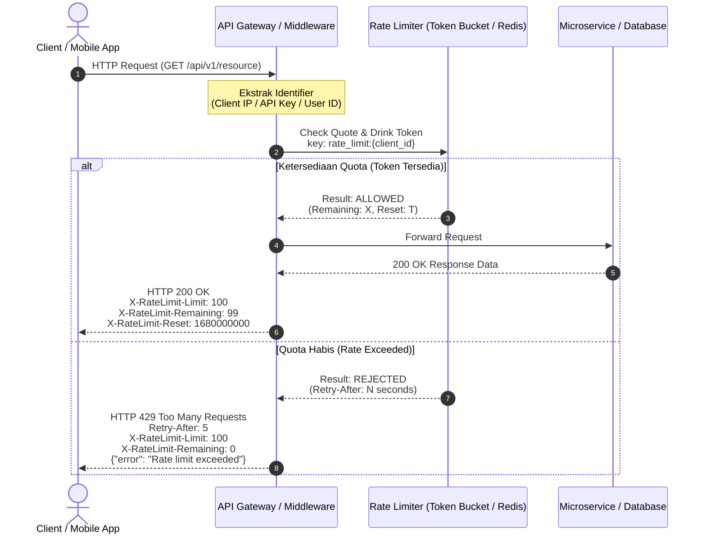

```mermaid
sequenceDiagram
    autonumber
    actor Client as Client / Mobile App
    participant Gateway as API Gateway / Middleware
    participant Limiter as Rate Limiter (Token Bucket / Redis)
    participant Backend as Microservice / Database

    Client->>Gateway: HTTP Request (GET /api/v1/resource)
    Note over Gateway: Ekstrak Identifier<br/>(Client IP / API Key / User ID)
    
    Gateway->>Limiter: Check Quote & Drink Token<br/>key: rate_limit:{client_id}
    
    alt Ketersediaan Quota (Token Tersedia)
        Limiter-->>Gateway: Result: ALLOWED<br/>(Remaining: X, Reset: T)
        Gateway->>Backend: Forward Request
        Backend-->>Gateway: 200 OK Response Data
        Gateway-->>Client: HTTP 200 OK<br/>X-RateLimit-Limit: 100<br/>X-RateLimit-Remaining: 99<br/>X-RateLimit-Reset: 1680000000
    else Quota Habis (Rate Exceeded)
        Limiter-->>Gateway: Result: REJECTED<br/>(Retry-After: N seconds)
        Gateway-->>Client: HTTP 429 Too Many Requests<br/>Retry-After: 5<br/>X-RateLimit-Limit: 100<br/>X-RateLimit-Remaining: 0<br/>{"error": "Rate limit exceeded"}
    end
```
