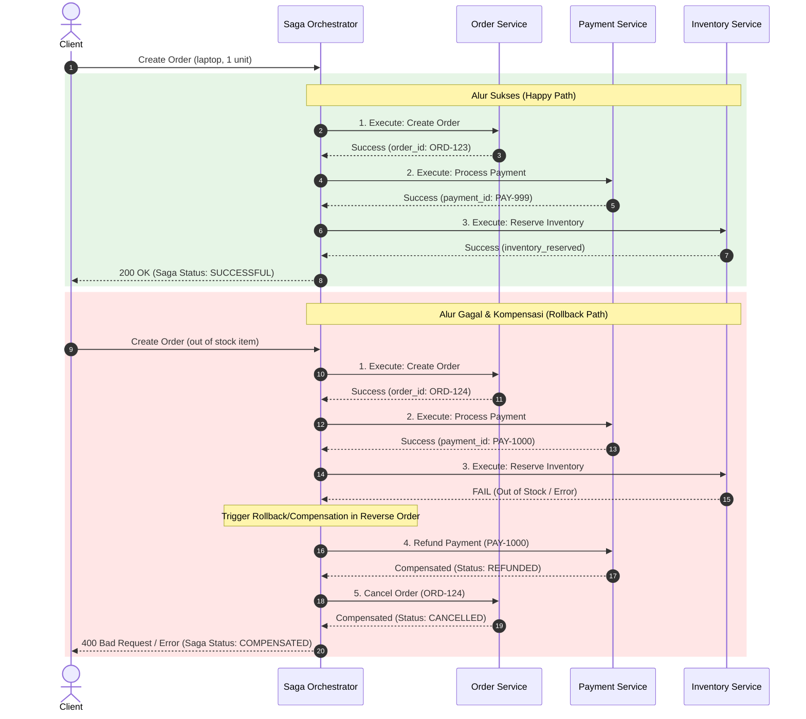
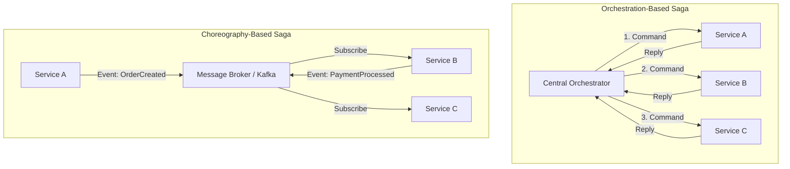

# Saga Pattern Diagram

## Orchestration-Based Saga Workflow

```mermaid
sequenceDiagram
    autonumber
    actor Client
    participant Orchestrator as Saga Orchestrator
    participant OrderService as Order Service
    participant PaymentService as Payment Service
    participant InventoryService as Inventory Service

    Client->>Orchestrator: Create Order (laptop, 1 unit)
    
    rect rgb(230, 245, 230)
        note over Orchestrator, InventoryService: Alur Sukses (Happy Path)
        Orchestrator->>OrderService: 1. Execute: Create Order
        OrderService-->>Orchestrator: Success (order_id: ORD-123)
        
        Orchestrator->>PaymentService: 2. Execute: Process Payment
        PaymentService-->>Orchestrator: Success (payment_id: PAY-999)
        
        Orchestrator->>InventoryService: 3. Execute: Reserve Inventory
        InventoryService-->>Orchestrator: Success (inventory_reserved)
        
        Orchestrator-->>Client: 200 OK (Saga Status: SUCCESSFUL)
    end

    rect rgb(255, 230, 230)
        note over Orchestrator, InventoryService: Alur Gagal & Kompensasi (Rollback Path)
        Client->>Orchestrator: Create Order (out of stock item)
        Orchestrator->>OrderService: 1. Execute: Create Order
        OrderService-->>Orchestrator: Success (order_id: ORD-124)
        
        Orchestrator->>PaymentService: 2. Execute: Process Payment
        PaymentService-->>Orchestrator: Success (payment_id: PAY-1000)
        
        Orchestrator->>InventoryService: 3. Execute: Reserve Inventory
        InventoryService-->>Orchestrator: FAIL (Out of Stock / Error)
        
        note over Orchestrator: Trigger Rollback/Compensation in Reverse Order
        
        Orchestrator->>PaymentService: 4. Refund Payment (PAY-1000)
        PaymentService-->>Orchestrator: Compensated (Status: REFUNDED)
        
        Orchestrator->>OrderService: 5. Cancel Order (ORD-124)
        OrderService-->>Orchestrator: Compensated (Status: CANCELLED)
        
        Orchestrator-->>Client: 400 Bad Request / Error (Saga Status: COMPENSATED)
    end
```

## Comparisons: Orchestration vs Choreography

```mermaid
graph TD
    subgraph Orchestration [Orchestration-Based Saga]
        O[Central Orchestrator] -->|1. Command| A[Service A]
        O -->|2. Command| B[Service B]
        O -->|3. Command| C[Service C]
        A -->|Reply| O
        B -->|Reply| O
        C -->|Reply| O
    end

    subgraph Choreography [Choreography-Based Saga]
        CA[Service A] -->|Event: OrderCreated| MB[Message Broker / Kafka]
        MB -->|Subscribe| CB[Service B]
        CB -->|Event: PaymentProcessed| MB
        MB -->|Subscribe| CC[Service C]
    end
```
